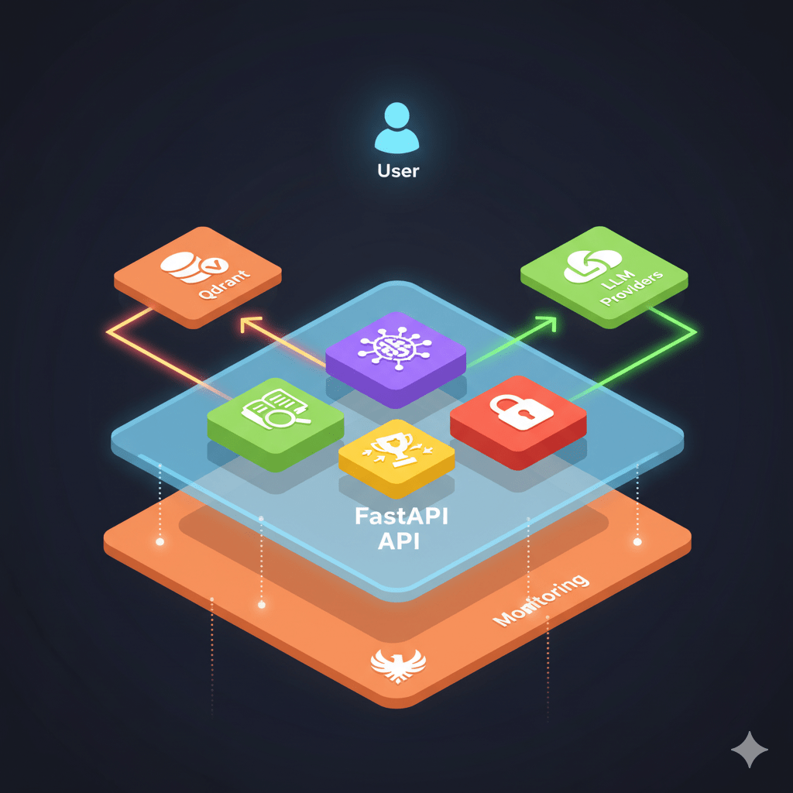
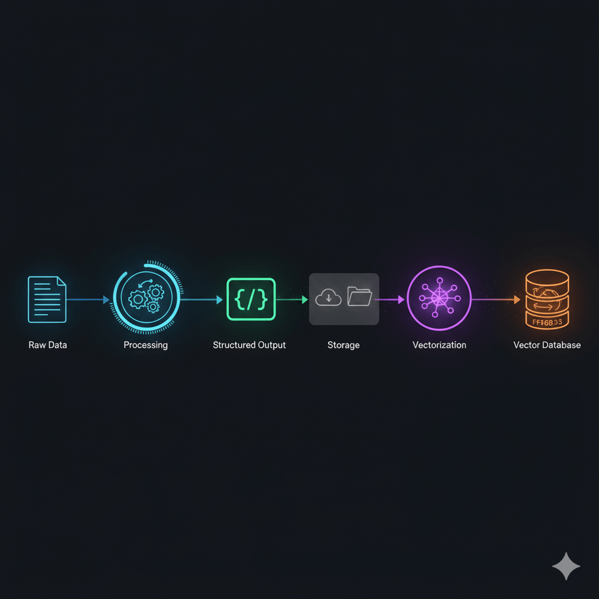
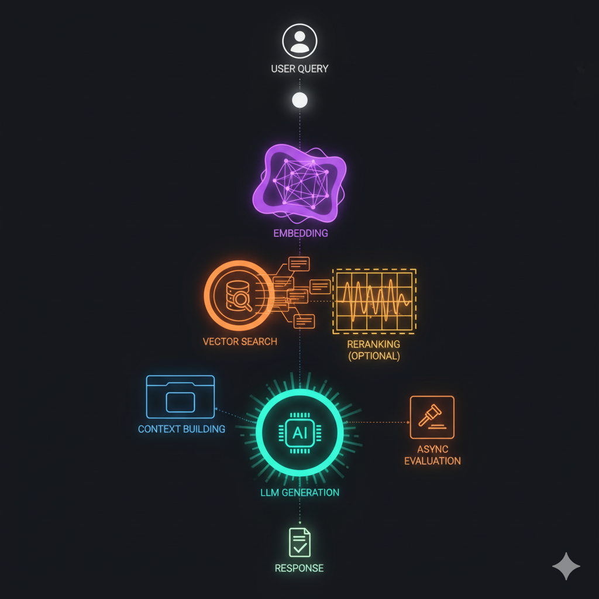

<div align="center">

<!-- Banner Principal -->


<br/>

# 🚀 Proyecto Py Labor Law RAG (lus-laboris-py)

<!-- CI/CD Status -->
[](https://github.com/jesusoviedo/lus-laboris-py/actions/workflows/code-quality.yml)
[](https://github.com/jesusoviedo/lus-laboris-py/actions/workflows/docker-processing-build-publish.yml)
[](https://github.com/jesusoviedo/lus-laboris-py/actions/workflows/docker-api-build-publish.yml)
[](https://github.com/jesusoviedo/lus-laboris-py/actions/workflows/terraform-apply-on-tf-change.yml)
[](https://github.com/jesusoviedo/lus-laboris-py/actions/workflows/deploy-qdrant.yml)
[](https://github.com/jesusoviedo/lus-laboris-py/actions/workflows/update-batch-job-image.yml)
[](https://github.com/jesusoviedo/lus-laboris-py/actions/workflows/update-api-secrets-deploy.yml)

<!-- Language & Package Manager -->
[](https://www.python.org/)
[](https://github.com/astral-sh/uv)

<!-- Main Framework & AI Stack -->
[](https://fastapi.tiangolo.com/)
[](https://openai.com/)
[](https://ai.google/)
[](https://qdrant.tech/)
[](https://phoenix.arize.com/)

<!-- DevOps & Infrastructure -->
[](https://www.docker.com/)
[](https://developer.hashicorp.com/terraform)
[](https://docs.github.com/en/actions)
[](https://github.com/pre-commit/pre-commit)

<!-- Cloud Platform -->
[](https://cloud.google.com/run)
[](https://cloud.google.com/storage)
[](https://cloud.google.com/compute)

<!-- License -->
[](https://opensource.org/licenses/MIT)

**Language / Idioma:**
[🇺🇸 English](#Introduction) | [🇪🇸 Español](#Introducción)

</div>

---

## 📌 Introduction

**lus-laboris-py** is a RAG (Retrieval-Augmented Generation) application that provides intelligent access to Paraguay's Labor Code (Law Nº 213). The system enables users to query legal information through natural language using advanced AI technologies.



### Key Workflow

- **Data Processing**: Extract, clean, and structure legal text
- **Vector Storage**: Index processed data in Qdrant vector database
- **Intelligent Querying**: Use OpenAI and Google Gemini with specialized prompts for accurate responses
- **API Access**: REST API built with FastAPI for seamless integration
- **Cloud Deployment**: Automated infrastructure management with Terraform and GitHub Actions



## 📂 Project Structure

| Directory | Purpose |
|-----------|---------|
| `data/` | Raw and processed legal data storage |
| `src/lus_laboris_api/` | FastAPI REST API for legal document queries |
| `src/processing/` | Data processing and text extraction pipelines |
| `services/` | External services (Qdrant, Phoenix) with management script |
| `notebooks/` | Analysis, experimentation and offline RAG system performance evaluation |
| `terraform/` | Infrastructure as Code for Google Cloud Platform |
| `tests/` | Unit and integration tests for quality assurance |
| `docs/` | Comprehensive project documentation and guides |
| `docs/images/` | Project images, banners, and visual assets |
| `utils/` | Utility scripts for automation and management |
| `.github/workflows/` | CI/CD automation workflows |

## ⚙️ Prerequisites

- **Python 3.13** (managed with `uv`)
- **Terraform** (for infrastructure management)
- **Google Cloud Platform** account with appropriate permissions
- **Docker** (for containerized development)

## 🚀 Getting Started

### 1. Clone and Setup

```bash
git clone https://github.com/jesusoviedo/lus-laboris-py.git
cd lus-laboris-py
```

### 2. Environment Configuration

Create a `.env` file at the project root with required variables:

```bash
# Copy the example file and customize it
cp .env_example .env
# Edit the .env file with your values
```

The `.env_example` file contains all required variables organized by category:

- **Docker Configuration**: DockerHub credentials and image names
- **GCP Configuration**: Project, region, and bucket settings
- **Cloud Run Services**: Batch jobs and API service configuration
- **Compute Engine**: VM settings for Qdrant hosting
- **Qdrant Configuration**: Vector database connection settings
- **LLM/Embeddings**: OpenAI and other provider credentials
- **JWT Authentication**: Key paths and token settings
- **Local API**: FastAPI settings for development

See [docs/setup_gcp_project.md](docs/setup_gcp_project.md) for detailed configuration instructions.

### 3. Infrastructure Setup

```bash
# Automated GCP project setup
bash utils/setup_gcp_project.sh

# Deploy infrastructure
cd terraform/
bash tf_menu.sh
```

### 4. Local Development

```bash
# Test workflows locally
cd .github/workflows/
bash act_menu.sh

# Run notebooks
cd notebooks/
uv run jupyter notebook

# Start the API locally
cd src/lus_laboris_api/
bash start_api_dev.sh
```

## 📋 Key Features

- **🤖 AI-Powered Legal Search**: Advanced RAG system with optional document reranking for legal document queries
- **☁️ Cloud-Native Architecture**: Scalable deployment on Google Cloud Platform
- **🔧 Infrastructure as Code**: Complete automation with Terraform
- **📊 Monitoring & Evaluation**: Comprehensive system performance tracking with RAG pipeline evaluation
- **🔄 CI/CD Pipeline**: Automated testing and deployment workflows
- **📚 Extensive Documentation**: Detailed guides for setup and usage
- **🔍 RAG Evaluation Framework**: Complete evaluation system for retrieval and generation quality



## ☁️ Cloud Deployment

The project infrastructure is deployed to Google Cloud Platform using Terraform and GitHub Actions workflows.

### Quick Start

```bash
# Setup GCP project and infrastructure
bash utils/setup_gcp_project.sh
cd terraform/
bash tf_menu.sh

# Deploy API updates
# GitHub Actions → Update API Secrets & Deploy → Run workflow
```

For detailed deployment instructions, see:

- [terraform/README.md](terraform/README.md) - Infrastructure setup
- [docs/setup_gcp_project.md](docs/setup_gcp_project.md) - GCP configuration
- [docs/gcp_resources_guide.md](docs/gcp_resources_guide.md) - GCP resources overview
- [.github/workflows/README.md](.github/workflows/README.md) - Workflows documentation

## 📚 Documentation

| Component | Documentation |
|-----------|---------------|
| **API** | [FastAPI Documentation](src/lus_laboris_api/README.md) |
| **Data Processing** | [Processing Pipeline](src/processing/README.md) |
| **Vector Store** | [Qdrant Operations](services/vectordb/README.md) |
| **Monitoring** | [Phoenix Observability](services/monitoring/README.md) |
| **Notebooks** | [Jupyter Notebooks Guide](notebooks/README.md) |
| **Testing** | [Testing Documentation](tests/README.md) |
| **Infrastructure** | [Terraform Guide](terraform/README.md) |
| **Automation** | [GitHub Actions](.github/workflows/README.md) |
| **Utilities** | [Utility Scripts](utils/README.md) |
| **Technical Guides** | [Complete Guides Index](docs/README.md) - GCP, Docker, UV, FastAPI, Phoenix, Qdrant, and more |

## 👥 Contributing

1. Fork the repository
2. Create a feature branch (`git checkout -b feature/amazing-feature`)
3. Commit your changes (`git commit -m 'Add amazing feature'`)
4. Push to the branch (`git push origin feature/amazing-feature`)
5. Open a Pull Request

## 📜 License

This project is licensed under the MIT License - see the [LICENSE](LICENSE) file for details.

---

## 📌 Introducción

**lus-laboris-py** es una aplicación RAG (Retrieval-Augmented Generation) que proporciona acceso inteligente al Código del Trabajo de Paraguay (Ley Nº 213). El sistema permite a los usuarios consultar información legal a través de lenguaje natural utilizando tecnologías avanzadas de IA.

### Flujo Principal

- **Procesamiento de Datos**: Extracción, limpieza y estructuración del texto legal
- **Almacenamiento Vectorial**: Indexación de datos procesados en base de datos vectorial Qdrant
- **Consultas Inteligentes**: Uso de OpenAI y Google Gemini con prompts especializados para respuestas precisas
- **Acceso API**: API REST construida con FastAPI para integración fluida
- **Despliegue en la Nube**: Gestión automatizada de infraestructura con Terraform y GitHub Actions

## 📂 Estructura del Proyecto

| Directorio | Propósito |
|------------|-----------|
| `data/` | Almacenamiento de datos legales crudos y procesados |
| `src/lus_laboris_api/` | API REST FastAPI para consultas de documentos legales |
| `src/processing/` | Pipelines de procesamiento de datos y extracción de texto |
| `services/` | Servicios externos (Qdrant, Phoenix) con script de gestión |
| `notebooks/` | Análisis, experimentación y evaluación offline del rendimiento del sistema RAG |
| `terraform/` | Infraestructura como Código para Google Cloud Platform |
| `tests/` | Tests unitarios y de integración para aseguramiento de calidad |
| `docs/` | Documentación completa del proyecto y guías |
| `docs/images/` | Imágenes del proyecto, banners y recursos visuales |
| `utils/` | Scripts de utilidad para automatización y gestión |
| `.github/workflows/` | Workflows de automatización CI/CD |

## ⚙️ Requisitos Previos

- **Python 3.13** (gestionado con `uv`)
- **Terraform** (para gestión de infraestructura)
- **Google Cloud Platform** cuenta con permisos apropiados
- **Docker** (para desarrollo containerizado)

## 🚀 Cómo Empezar

### 1. Clonar y Configurar

```bash
git clone https://github.com/jesusoviedo/lus-laboris-py.git
cd lus-laboris-py
```

### 2. Configuración del Entorno

Crear un archivo `.env` en la raíz del proyecto con las variables requeridas:

```bash
# Copiar el archivo de ejemplo y personalizarlo
cp .env_example .env
# Editar el archivo .env con tus valores
```

El archivo `.env_example` contiene todas las variables requeridas organizadas por categoría:

- **Configuración Docker**: Credenciales de DockerHub y nombres de imágenes
- **Configuración GCP**: Configuraciones de proyecto, región y bucket
- **Servicios Cloud Run**: Configuración de trabajos batch y servicio API
- **Compute Engine**: Configuraciones de VM para hospedar Qdrant
- **Configuración Qdrant**: Configuraciones de conexión a la base de datos vectorial
- **LLM/Embeddings**: Credenciales de OpenAI y otros proveedores
- **Autenticación JWT**: Rutas de claves y configuraciones de tokens
- **API Local**: Configuraciones de FastAPI para desarrollo

Ver [docs/setup_gcp_project.md](docs/setup_gcp_project.md) para instrucciones detalladas de configuración.

### 3. Configuración de Infraestructura

```bash
# Configuración automatizada del proyecto GCP
bash utils/setup_gcp_project.sh

# Desplegar infraestructura
cd terraform/
bash tf_menu.sh
```

### 4. Desarrollo Local

```bash
# Probar workflows localmente
cd .github/workflows/
bash act_menu.sh

# Ejecutar notebooks
cd notebooks/
uv run jupyter notebook

# Iniciar la API localmente
cd src/lus_laboris_api/
bash start_api_dev.sh
```

## 📋 Características Principales

- **🤖 Búsqueda Legal con IA**: Sistema RAG avanzado con reranking opcional de documentos para consultas de documentos legales
- **☁️ Arquitectura Cloud-Native**: Despliegue escalable en Google Cloud Platform
- **🔧 Infraestructura como Código**: Automatización completa con Terraform
- **📊 Monitoreo y Evaluación**: Seguimiento integral del rendimiento del sistema con evaluación de pipeline RAG
- **🔄 Pipeline CI/CD**: Workflows automatizados de testing y despliegue
- **📚 Documentación Extensa**: Guías detalladas para configuración y uso
- **🔍 Framework de Evaluación RAG**: Sistema completo de evaluación para calidad de recuperación y generación

## ☁️ Despliegue en la Nube

La infraestructura del proyecto se despliega en Google Cloud Platform usando Terraform y workflows de GitHub Actions.

### Inicio Rápido

```bash
# Configurar proyecto GCP e infraestructura
bash utils/setup_gcp_project.sh
cd terraform/
bash tf_menu.sh

# Desplegar actualizaciones de la API
# GitHub Actions → Update API Secrets & Deploy → Run workflow
```

Para instrucciones detalladas de despliegue, consultar:

- [terraform/README.md](terraform/README.md) - Configuración de infraestructura
- [docs/setup_gcp_project.md](docs/setup_gcp_project.md) - Configuración de GCP
- [docs/gcp_resources_guide.md](docs/gcp_resources_guide.md) - Guía de recursos de GCP
- [.github/workflows/README.md](.github/workflows/README.md) - Documentación de workflows

## 📚 Documentación

| Componente | Documentación |
|------------|---------------|
| **API** | [Documentación FastAPI](src/lus_laboris_api/README.md) |
| **Procesamiento de Datos** | [Pipeline de Procesamiento](src/processing/README.md) |
| **Base de Datos Vectorial** | [Operaciones Qdrant](services/vectordb/README.md) |
| **Monitoreo** | [Observabilidad Phoenix](services/monitoring/README.md) |
| **Notebooks** | [Guía de Jupyter Notebooks](notebooks/README.md) |
| **Testing** | [Documentación de Tests](tests/README.md) |
| **Infraestructura** | [Guía de Terraform](terraform/README.md) |
| **Automatización** | [GitHub Actions](.github/workflows/README.md) |
| **Utilidades** | [Scripts de Utilidad](utils/README.md) |
| **Guías Técnicas** | [Índice Completo de Guías](docs/README.md) - GCP, Docker, UV, FastAPI, Phoenix, Qdrant, y más |

## 👥 Contribuciones

1. Fork del repositorio
2. Crear una rama de feature (`git checkout -b feature/caracteristica-increible`)
3. Commit de los cambios (`git commit -m 'Agregar característica increíble'`)
4. Push a la rama (`git push origin feature/caracteristica-increible`)
5. Abrir un Pull Request

## 📜 Licencia

Este proyecto está bajo la Licencia MIT - ver el archivo [LICENSE](LICENSE) para más detalles.
