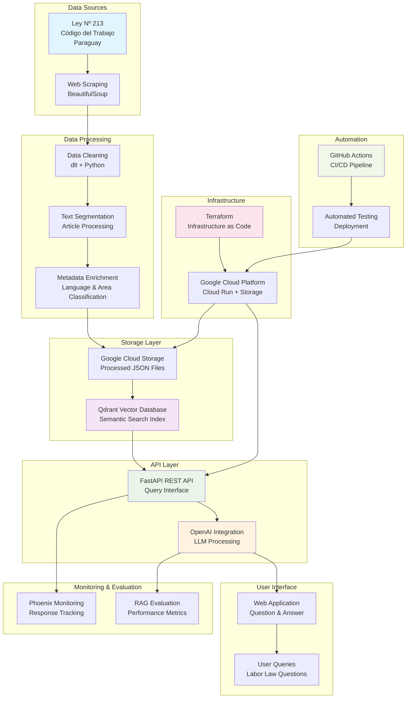

# Project Architecture Diagram

## System Overview

## Technology Stack

- **Data Extraction**: BeautifulSoup, Python
- **Data Processing**: dlt, Python
- **Storage**: Google Cloud Storage, Qdrant
- **API**: FastAPI, OpenAI
- **Infrastructure**: Terraform, Google Cloud Run
- **Monitoring**: Phoenix
- **Automation**: GitHub Actions
- **Package Management**: UV
